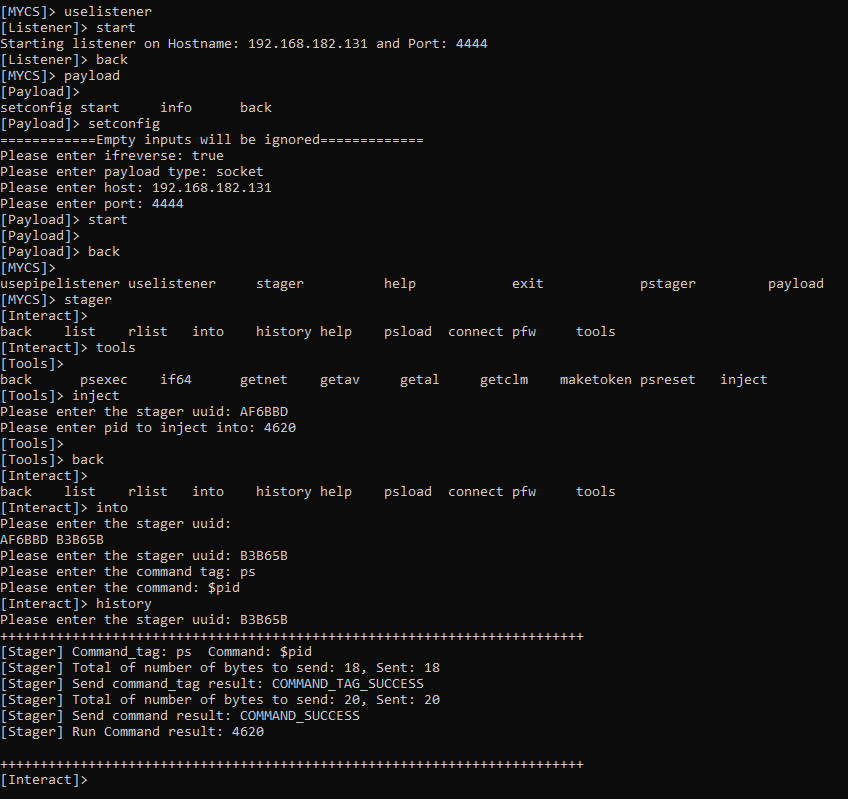

# myc2
This is my version of c2, indented for penetration testing, but also useful for validation automation. 

* reverse/bind socket/pipe shell
* exe/ps1 payload
* buildin ps command lists to get av,clm,al
* command history for each stager
* tab completion
* AMSI/AV bypass

# psload + maketoken
* psload can be used to load any ps script in the database to the stager runspace
* maketoken from sharpsploit is integrated

# psexec
* psexec can be chained with maketoken

# process injection

