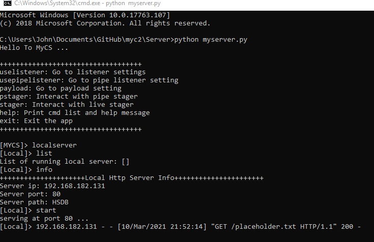
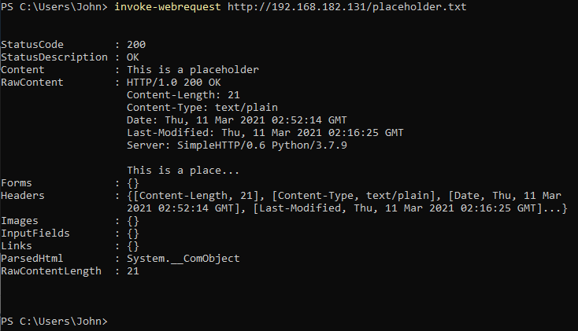
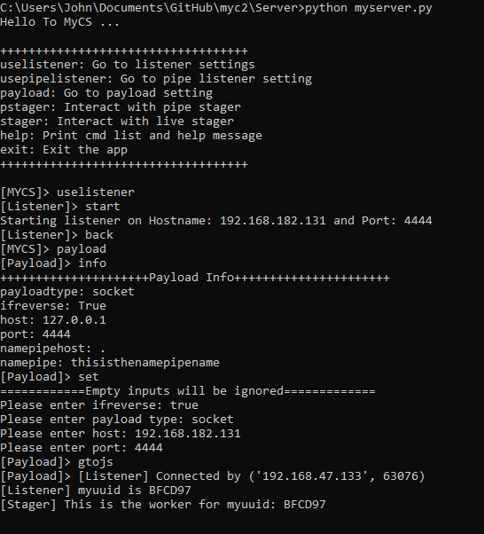
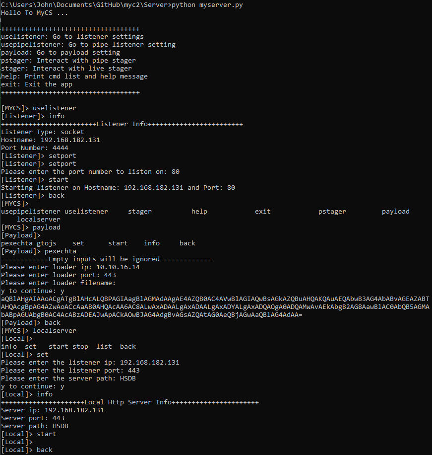
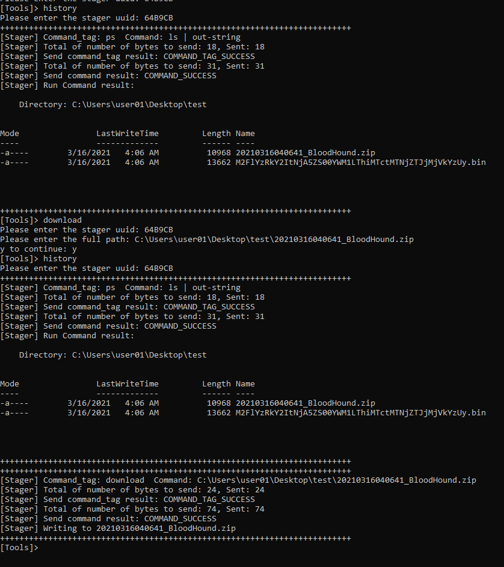
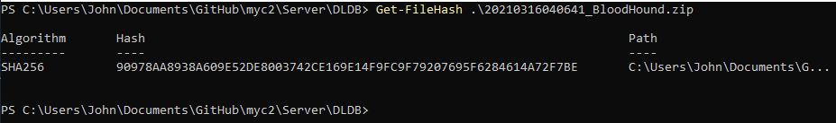
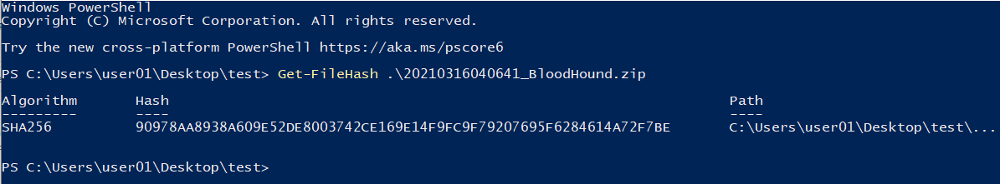
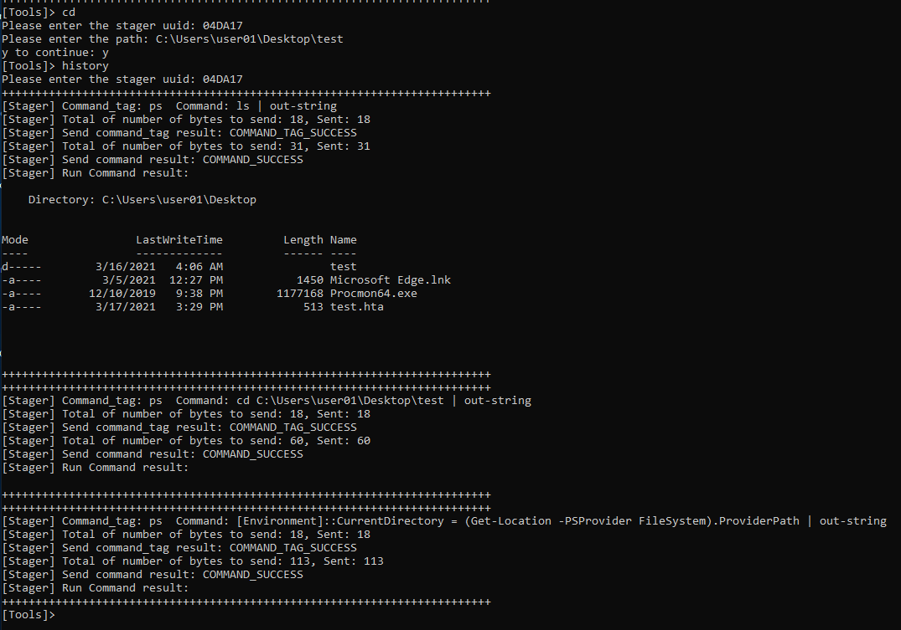
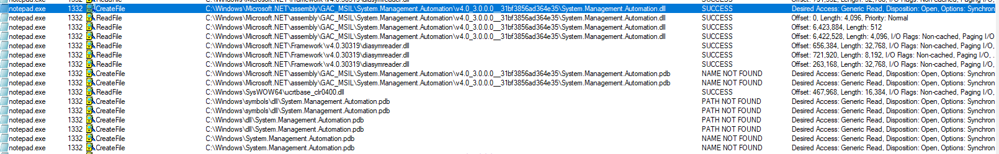

# myc2
This is my version of c2, intended for penetration testing, but also useful for validation automation. 

* reverse/bind socket/pipe shell
* exe/ps1 payload
* hta/js/vba/vbs payload using GadgetToJScript
* buildin ps command lists to get av,clm,al
* command history for each stager
* tab completion
* AMSI/AV bypass

# dependence
* python3.7 + pywin32
* Microsoft Visual Studio 2019
* If you prefer kali, use networking trick
  ```
  sudo sysctl -w net.ipv4.ip_forward=1
  sudo iptables -t nat -A POSTROUTING -o [VPN INTERFACE] -j MASQUERADE
  [Add Kali ip to Windows route table]
  sudo iptables -t nat -A PREROUTING -d [VPN IP] -j DNAT --to-destination [LOCAL WINDOWS]
  sudo iptables -t nat -A POSTROUTING -s [LOCAL WINDOWS] -j SNAT --to-source [VPN IP]
  ```


# psload + maketoken
* psload can be used to load any ps script in the database to the stager runspace
* maketoken from sharpsploit is integrated


# psexec
* psexec can be chained with maketoken


# process injection


# local httpserver



# extra payload types


# extra hta template
* depends on target stystem config, the hta -> powershell sequence might be useful in somecase. 
 


# file download




# change directory (ps + .net)
* `cd` in `tool` will change both ps directory and .net directory the same time. 



# Interesting findings
* With .Net 4.8 on 17763 (ie. KB4486153), process injection using the technique available in GadgetToJSscript template will fail to load `System.Management.Automation.dll` on the targeted process. It only happens with 32bit and possible workaround with inject to `powershell.exe` instead. 



# disclaimer
* for education and reseach only
* some of the imbedded tools are from online repo and training course, and improved/av-bypessed by me. let me know if licensing issue, will remove immediately.

# reference
* https://www.offensive-security.com/pen300-osep/
* https://www.pentesteracademy.com/redlabs
* https://github.com/xpn
* https://github.com/S3cur3Th1sSh1t
* https://github.com/0x00-0x00/NamedPipes
* https://github.com/med0x2e/GadgetToJScript 

